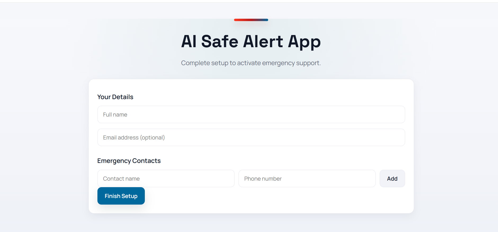
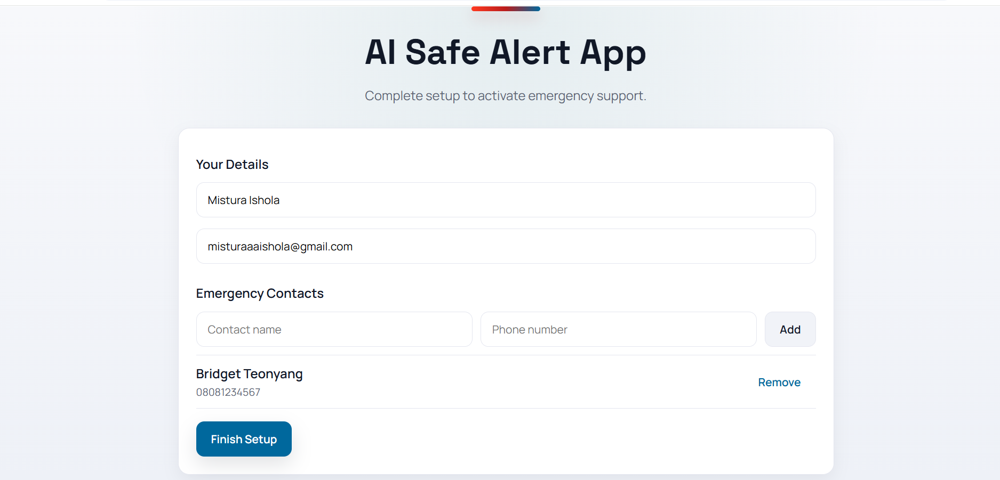
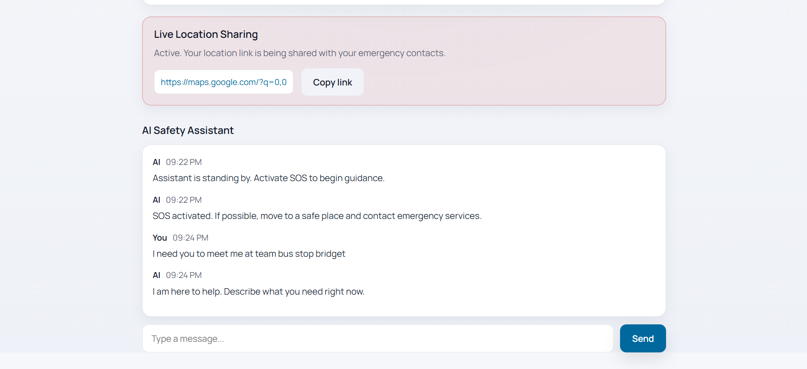

# AI Safe Alert App

---

## Project Overview
AI Safe Alert App is a safety-focused web application that enables users to quickly send emergency alerts, share location and receive AI-guided assistance in distress situations.

The app includes an AI-powered assistant that provides real-time safety guidance, emergency response suggestions and supports faster access to help through location sharing and alert notifications.

---

## Features
- One-tap SOS alert
- Emergency contact notification (UI simulation)
- Live location sharing (link-based)
- AI chatbot guidance
- User onboarding (name & emergency contacts)

---

## Tech Stack
### Frontend
- React 19 – Component-based UI development
- Vite 8 – Fast build tool and development server
- JavaScript (ES Modules) – Modern JS syntax
- CSS – Custom styling for responsive UI
  
### Tooling
- ESLint – Code quality and linting
- React Hooks plugin – Enforces best practices
- React Refresh plugin – Enables fast refresh during development

---

## How to Run Locally

1. Clone the repository:
   ```bash
   git clone https://github.com/MisturaDev/ai-safe-alert-app.git

 2. Navigate into the project folder:
    ```bash
    cd ai-safe-alert-app

 3. Install dependencies:
    ```bash
    npm install

  4. Run the app:
     ```bash
     npm run dev

---

## Live Demo

[Live Demo](https://ai-safe-alert-app.vercel.app/)

---

## Screenshots

| Home Screen | Onboarding |
|------------|----------------|
|  |  |

| SOS Button | AI-chatbot |
|---------------|-----------------|
|  |  |


---

## Project Structure

```bash
src/
  assets/
  components/
    ChatBot.jsx
    Onboarding.jsx
    SOSButton.jsx
    screenshots/
  pages/
  App.css
  App.jsx
  index.css
  main.jsx


---

## AI Integration
The application includes a rule-based AI chatbot that provides real-time safety guidance based on user input.

Example:
- "help" → safety instructions
- "danger" → emergency response steps


---

## Team Roles

- Software Developer
- Product Manager
- Product Designer

**Group 10 – Women Techsters Bootcamp 5.0**


